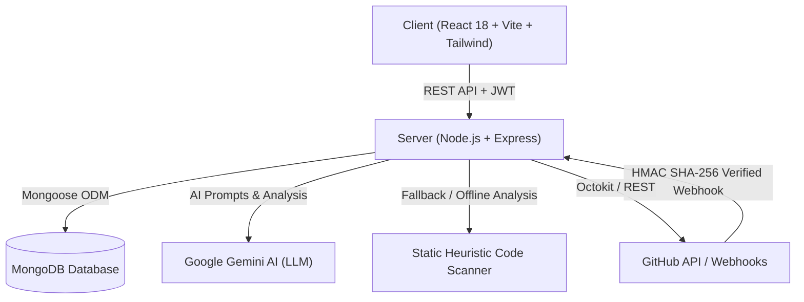

# 🔍 Reviewly — AI-Powered Code Review & Repository Intelligence Platform

Reviewly is an intelligent, full-stack code analysis and automated code review platform built using the **MERN** (MongoDB, Express, React, Node.js) stack and integrated with **Google Gemini AI**. Reviewly connects to GitHub repositories, analyzes multi-language source code, identifies security vulnerabilities, discovers bugs, evaluates code quality metrics, and provides deep architectural breakdowns.

---

## 🚀 Key Features

- **🤖 AI Repository Explainer**: Summarizes repository purpose, target audience, architectural patterns, tech stack breakdown, and key file maps.
- **🐛 Automated Bug & Flaw Detection**: Scans codebase syntax, logic, and patterns to highlight potential bugs, edge cases, and suggested fixes.
- **📊 Code Quality & Maintainability Score**: Rates overall health out of 100 based on modularity, documentation, complexity, error handling, and test coverage.
- **🛡️ Security & Vulnerability Scanner**: Identifies security risks (e.g., hardcoded secrets, injection vectors, unescaped DOM sinks, missing sanitization) with severity tags (`HIGH`, `MEDIUM`, `LOW`).
- **📦 Dependency & Tech Stack Inspector**: Maps library versions, frameworks, CDNs, and flags outdated or heavy packages.
- **🧠 Hybrid Analysis Engine**: Combines **Google Gemini 2.0 Flash AI** with an advanced **Dynamic Static Code Analyzer (Heuristics Engine)** that works reliably across Vanilla JS, React, Python, Java, Go, Rust, C/C++, HTML5/CSS3, and more.
- **🔄 GitHub Webhook & Pull Request Reviews**: Automated PR analysis with automated line-by-line comments and security validation via HMAC SHA-256 signatures.
- **🔐 Modern Authentication**: JWT-based access with silent token refresh, rate-limited login/registration, and guest preview modes.

---

## 🏗️ System Architecture



---

## 📁 Repository Structure

```
AI-CODE/
├── client/                     # Frontend Application
│   ├── public/                 # Static assets
│   ├── src/
│   │   ├── components/         # Reusable UI components & modals
│   │   ├── context/            # Authentication & application context
│   │   ├── hooks/              # Custom React hooks
│   │   ├── lib/                # Axios instance & interceptors
│   │   ├── pages/              # Landing, Dashboard, and Repo Detail views
│   │   └── stores/             # Client state management
│   ├── package.json
│   ├── tailwind.config.js
│   ├── vite.config.js
│   └── README.md
│
├── server/                     # Backend API & Analysis Engine
│   ├── src/
│   │   ├── config/             # DB & environmental configuration
│   │   ├── controllers/        # Request handlers (AI, Auth, Repos, PRs)
│   │   ├── middleware/         # Auth JWT, rate limiters, webhook verification
│   │   ├── models/             # Mongoose schemas (User, Repo, BugReport, etc.)
│   │   ├── routes/             # Express API routes
│   │   ├── services/           # Gemini AI, GitHub API, Static Code Analyzer
│   │   └── utils/              # Helper utilities
│   ├── package.json
│   └── README.md
│
└── README.md                   # Root Project Documentation
```

---

## 🛠️ Tech Stack

| Domain | Technologies |
| :--- | :--- |
| **Frontend** | React 18, Vite, Tailwind CSS, Lucide Icons, Axios, React Router v6 |
| **Backend** | Node.js (ES Modules), Express.js, Mongoose ODM, Octokit |
| **Database** | MongoDB (Local or Atlas) |
| **AI & Engine** | Google Gemini 2.0 Flash API, Custom Heuristic Static AST Analyzer |
| **Security** | JWT (JSON Web Tokens), bcryptjs, HMAC SHA-256 Webhook Verification |

---

## ⚙️ Quick Start & Installation

### 1. Prerequisites
- **Node.js** (v18.0.0 or higher)
- **MongoDB** (Local daemon or MongoDB Atlas connection string)
- **Git**

### 2. Clone and Setup Environment Variables

```bash
# Clone the repository
git clone <your-repo-url>
cd AI-CODE

# Backend Configuration
cp server/.env.example server/.env

# Frontend Configuration
cp client/.env.example client/.env
```

#### Example `server/.env`:
```env
PORT=4000
MONGODB_URI=mongodb://localhost:27017/reviewly
JWT_SECRET=your_super_secret_jwt_key
JWT_REFRESH_SECRET=your_super_secret_refresh_jwt_key
GITHUB_TOKEN=ghp_your_personal_access_token_optional
GITHUB_WEBHOOK_SECRET=your_webhook_secret
GEMINI_API_KEY=AIzaSy_your_gemini_api_key_from_google_ai_studio
CLIENT_URL=http://localhost:5173
```

#### Example `client/.env`:
```env
VITE_API_URL=http://localhost:4000/api
```

### 3. Install Dependencies

```bash
# Install Server Dependencies
cd server
npm install

# Install Client Dependencies
cd ../client
npm install
```

### 4. Run Locally

Open two terminal windows:

**Terminal 1 (Backend Server):**
```bash
cd server
npm run dev
# Server running at http://localhost:4000
```

**Terminal 2 (Frontend Client):**
```bash
cd client
npm run dev
# Client running at http://localhost:5173
```

---

## 🔌 API Endpoints Summary

### Authentication (`/api/auth`)
- `POST /api/auth/register` — Register a new account.
- `POST /api/auth/login` — Sign in and obtain JWT access + refresh tokens.
- `POST /api/auth/refresh` — Refresh access token silently.
- `GET /api/auth/me` — Fetch authenticated user profile.

### Repositories (`/api/repos`)
- `GET /api/repos` — Fetch repositories added by the authenticated user.
- `POST /api/repos` — Add a new GitHub repository (URL or `owner/name`).
- `GET /api/repos/:id` — Retrieve repository details and stored analysis.
- `DELETE /api/repos/:id` — Remove repository.

### AI & Code Analysis (`/api/analysis`)
- `POST /api/analysis/:repoId/explain` — Trigger/fetch AI codebase explanation.
- `GET /api/analysis/:repoId/explain` — Get cached AI explanation.
- `POST /api/analysis/:repoId/bugs` — Run deep bug & edge-case scan.
- `GET /api/analysis/:repoId/bugs` — Get cached bug report.
- `POST /api/analysis/:repoId/quality-score` — Evaluate 100-point maintainability metrics.
- `GET /api/analysis/:repoId/quality-score` — Get cached quality score.
- `POST /api/analysis/:repoId/security-scan` — Run security & vulnerability inspection.
- `GET /api/analysis/:repoId/security-scan` — Get cached security report.
- `POST /api/analysis/:repoId/dependencies` — Analyze package dependencies & health.
- `GET /api/analysis/:repoId/dependencies` — Get cached dependency report.

### Webhooks (`/api/webhooks`)
- `POST /api/webhooks/github` — GitHub webhook receiver with HMAC SHA-256 validation for pull request automated reviews.

---

